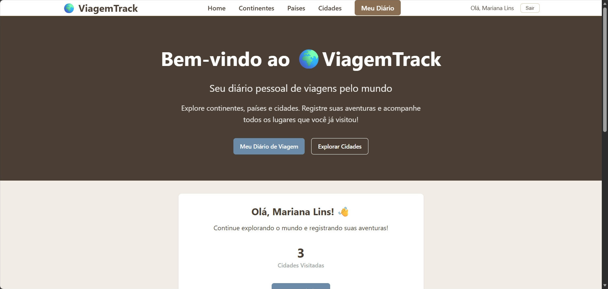
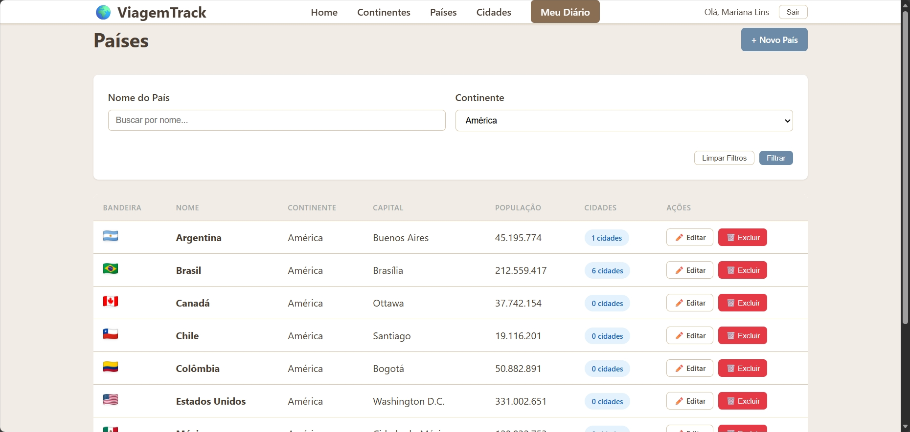
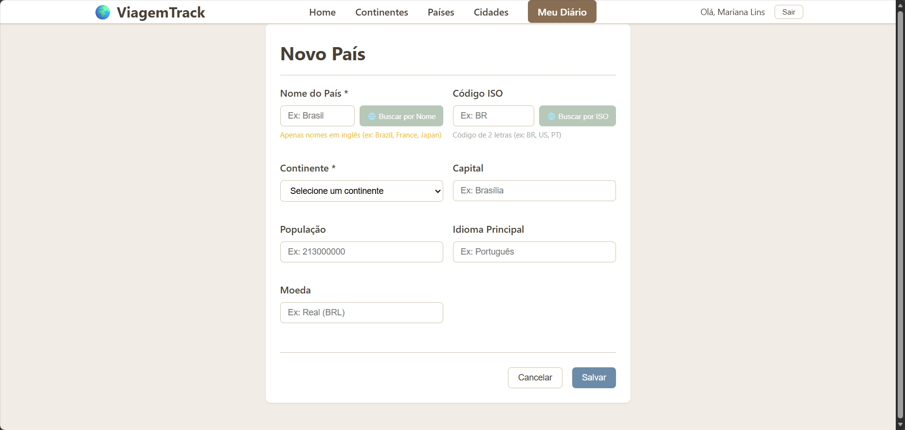
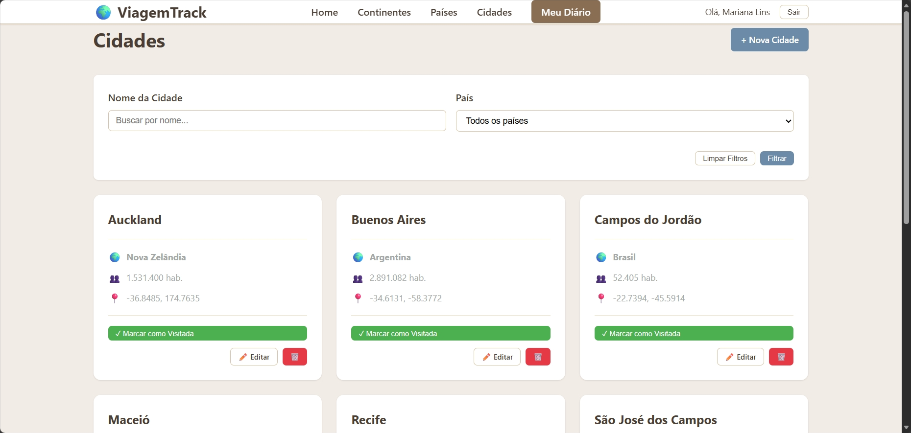
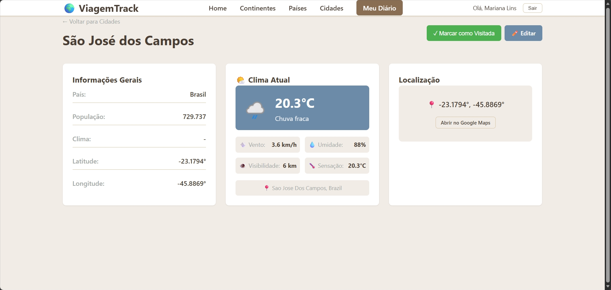
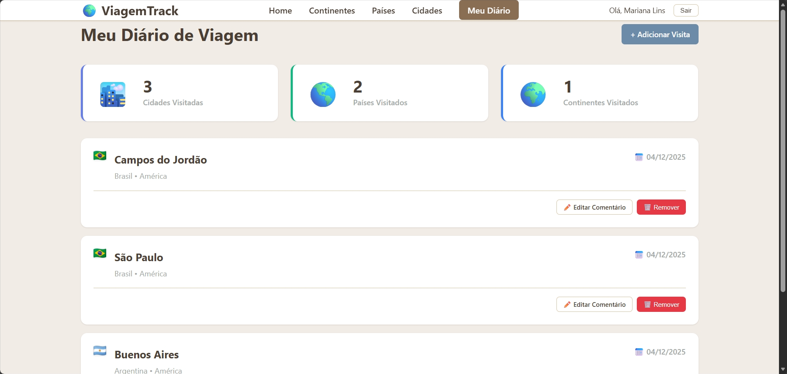

# 🌍 ViagemTrack

> Sistema completo de gerenciamento de viagens com diário pessoal, informações geográficas e integração com APIs externas.

[](https://nodejs.org/)
[](https://www.typescriptlang.org/)
[](https://reactjs.org/)
[](https://www.postgresql.org/)
[](https://www.prisma.io/)

## 📋 Sobre o Projeto

ViagemTrack é uma aplicação web full-stack desenvolvida como trabalho acadêmico para a disciplina de **Programação Web** do curso de **Análise e Desenvolvimento de Sistemas** da **FATEC**, sob orientação do **Professor André Olímpio**.

### 🎓 Contexto Acadêmico

**Atividade:** CRUD – TypeScript / PostgreSQL  
**Objetivo:** Desenvolver uma aplicação web completa (front-end e back-end) utilizando TypeScript e PostgreSQL, implementando operações CRUD e integração com APIs externas de dados geográficos.

### 🌟 Funcionalidades Implementadas

O sistema oferece:

- ✅ **Diário de Viagens**: Marque cidades visitadas e adicione comentários sobre suas experiências
- 🌤️ **Informações em Tempo Real**: Veja o clima atual de qualquer cidade
- 📊 **Estatísticas Pessoais**: Acompanhe quantas cidades e países você já visitou
- 🔐 **Sistema de Autenticação**: Conta pessoal protegida com JWT

📖 **Requisitos da atividade**: [docs/REQUISITOS.md](docs/REQUISITOS.md)

## 📸 Capturas de Tela

### Página Inicial


### Lista de Países


### Cadastro de Novo País


### Lista de Cidades


### Informações da Cidade


### Meu Diário de Viagens



## Quick Start

```bash
# Clone o repositório
git clone https://github.com/mariana-lins/VIAGEMTRACK_PROGWEB_FATEC.git
cd VIAGEMTRACK_PROGWEB_FATEC

# Configure as variáveis de ambiente
cp backend/.env.example backend/.env
# Edite backend/.env com suas credenciais do banco de dados

# Instale as dependências
cd backend && npm install
cd ../frontend && npm install

# Configure o banco de dados
cd ../backend
npx prisma generate
npx prisma migrate dev
npm run seed

# Inicie o projeto
# Terminal 1 - Backend
cd backend && npm run dev

# Terminal 2 - Frontend
cd frontend && npm run dev
```

Acesse: **http://localhost:5173**

📖 **Documentação completa**: [docs/INSTALACAO.md](docs/INSTALACAO.md)

## 🏗️ Arquitetura

### Stack Tecnológico

**Backend:**
- Node.js + Express.js + TypeScript
- PostgreSQL + Prisma ORM
- JWT para autenticação
- Bcrypt para hash de senhas

**Frontend:**
- React 18 + TypeScript + Vite
- React Router para navegação
- Axios para requisições HTTP
- CSS Modules para estilização

### Estrutura do Projeto

```
VIAGEMTRACK_PROGWEB_FATEC/
├── backend/              # API REST em Node.js
│   ├── src/
│   │   ├── controllers/  # Lógica de negócio
│   │   ├── routes/       # Definição de rotas
│   │   ├── services/     # Integração com APIs externas
│   │   ├── middleware/   # Autenticação e validações
│   │   └── config/       # Configurações (DB, etc)
│   ├── prisma/           # Schema e migrations
│   └── .env              # Variáveis de ambiente
│
├── frontend/             # Interface React
│   ├── src/
│   │   ├── components/   # Componentes reutilizáveis
│   │   ├── pages/        # Páginas da aplicação
│   │   ├── contexts/     # Contextos React (Auth)
│   │   ├── services/     # API client (Axios)
│   │   └── styles/       # Estilos globais
│   └── vite.config.ts
│
└── docs/                 # Documentação detalhada
    ├── INSTALACAO.md     # Guia de instalação
    ├── ARQUITETURA.md    # Arquitetura detalhada
    ├── API.md            # Documentação da API REST
    └── APIS_EXTERNAS.md  # APIs externas integradas
```

📖 **Arquitetura detalhada**: [docs/ARQUITETURA.md](docs/ARQUITETURA.md)

## 🔌 APIs Integradas

O projeto integra 3 APIs externas para enriquecer os dados:

| API | Função | Status |
|-----|--------|--------|
| **GeoNames** | Dados geográficos (países, cidades, população) 
| **WeatherAPI** | Clima atual e previsão do tempo 
| **Flagpedia** | Bandeiras dos países 

📖 **Documentação das APIs externas**: [docs/APIS_EXTERNAS.md](docs/APIS_EXTERNAS.md)

## 📡 API REST

A API REST oferece endpoints completos para gerenciar todos os recursos:

- **Autenticação**: Login, registro, perfil
- **Continentes**: CRUD completo
- **Países**: CRUD + busca por continente
- **Cidades**: CRUD + busca por país/continente + clima
- **Visitas**: Marcar cidades como visitadas + diário pessoal
- **APIs Externas**: GeoNames, WeatherAPI, Flagpedia

📖 **Documentação completa da API**: [docs/API.md](docs/API.md)

## 🎨 Funcionalidades

### Para Todos os Usuários
- 🌍 Explorar continentes, países e cidades
- 🔍 Buscar e filtrar informações geográficas
- 📊 Visualizar dados populacionais e estatísticas
- 🏳️ Ver bandeiras e informações dos países

### Para Usuários Autenticados
- ✅ Marcar cidades como visitadas
- 📝 Adicionar comentários sobre viagens
- 📚 Acessar diário pessoal de viagens
- 📊 Ver estatísticas de cidades visitadas
- 👤 Gerenciar perfil pessoal

### Funcionalidades Administrativas (CRUD)
- ➕ Criar continentes, países e cidades
- ✏️ Editar informações geográficas
- 🗑️ Remover registros
- 🌐 Preencher dados automaticamente via GeoNames

## 🔐 Segurança

- ✅ Senhas criptografadas com bcrypt (salt rounds: 10)
- ✅ Autenticação JWT com expiração de 7 dias
- ✅ Middleware de autenticação para rotas protegidas
- ✅ Variáveis de ambiente para dados sensíveis
- ✅ Validação de dados no backend
- ✅ CORS configurado corretamente

## 📊 Banco de Dados

**PostgreSQL** com **Prisma ORM**

### Schema Principal:
- `Continente` → `Pais` → `Cidade`
- `Usuario` → `Visita` → `Cidade`

### Recursos:
- Migrations versionadas
- Seed com dados iniciais (6 continentes + 40 países)
- Relacionamentos tipados
- Queries otimizadas

📖 **Schema completo**: [backend/prisma/schema.prisma](backend/prisma/schema.prisma)

## 🧪 Testando a API

```bash
# Health check
curl http://localhost:3000/health

# Listar continentes
curl http://localhost:3000/api/continentes

# Listar países
curl http://localhost:3000/api/paises

# Buscar país pelo GeoNames
curl http://localhost:3000/api/external/geonames/pais/BR

# Login
curl -X POST http://localhost:3000/api/usuarios/login \
  -H "Content-Type: application/json" \
  -d '{"email":"seu@email.com","senha":"suasenha"}'
```

## 📱 Páginas da Aplicação

| Rota | Página | Acesso |
|------|--------|--------|
| `/` | Home | Público |
| `/login` | Login | Público |
| `/registrar` | Registro | Público |
| `/continentes` | Lista de Continentes | Público |
| `/paises` | Lista de Países | Público |
| `/cidades` | Lista de Cidades | Público |
| `/cidades/:id` | Detalhes da Cidade | Público |
| `/diario` | Meu Diário de Viagens | Privado |
| `/paises/novo` | Criar País | Privado |
| `/cidades/novo` | Criar Cidade | Privado |

## 🛠️ Scripts Disponíveis

### Backend
```bash
npm run dev          # Inicia servidor em modo desenvolvimento
npm run build        # Compila TypeScript
npm start            # Inicia servidor em produção
npm run seed         # Popula banco com dados iniciais
```

### Frontend
```bash
npm run dev          # Inicia servidor de desenvolvimento
npm run build        # Build para produção
npm run preview      # Preview do build
```

## 📦 Dependências Principais

### Backend
- `express` - Framework web
- `@prisma/client` - ORM
- `jsonwebtoken` - Autenticação JWT
- `bcrypt` - Hash de senhas
- `axios` - Cliente HTTP
- `cors` - CORS middleware
- `dotenv` - Variáveis de ambiente

### Frontend
- `react` + `react-dom` - UI framework
- `react-router-dom` - Roteamento
- `axios` - Cliente HTTP
- `vite` - Build tool

## 🐛 Troubleshooting

### Backend não inicia
```bash
# Verifique se o PostgreSQL está rodando
# Verifique as credenciais em .env
# Execute as migrations
npx prisma migrate dev
```

### Frontend não conecta ao backend
- Verifique se o backend está rodando na porta 3000
- Verifique se o CORS está configurado corretamente
- Verifique a URL da API em `frontend/src/services/api.ts`

### GeoNames API retorna erro
- Verifique se o username está configurado
- Conta demo tem limite de requisições
- Considere criar conta gratuita no GeoNames

📖 **Mais soluções**: [docs/INSTALACAO.md#troubleshooting](docs/INSTALACAO.md)

## 📝 Licença

Este projeto foi desenvolvido como trabalho acadêmico para a FATEC.

## 👥 Autores

- **Mariana Lins** - [GitHub](https://github.com/mariana-lins)

## 🎓 Informações Acadêmicas

**Instituição:** FATEC - Faculdade de Tecnologia  
**Curso:** Análise e Desenvolvimento de Sistemas  
**Disciplina:** Programação Web  
**Professor:** André Olímpio  
**Período:** 4º Semestre  
**Ano:** 2024

**Atividade:** Desenvolvimento de aplicação web full-stack com TypeScript e PostgreSQL, implementando CRUD completo para gerenciamento de dados geográficos (continentes, países e cidades) com integração de APIs externas.

---

## 📚 Documentação Completa

- 📋 [Requisitos da Atividade](docs/REQUISITOS.md) - Requisitos do professor e checklist de cumprimento
- 📦 [Instalação e Setup](docs/INSTALACAO.md) - Guia completo de instalação
- 🏗️ [Arquitetura do Sistema](docs/ARQUITETURA.md) - Estrutura técnica detalhada
- 📡 [Documentação da API REST](docs/API.md) - Referência completa dos endpoints
- 🌐 [APIs Externas Integradas](docs/APIS_EXTERNAS.md) - GeoNames, WeatherAPI e Flagpedia

---